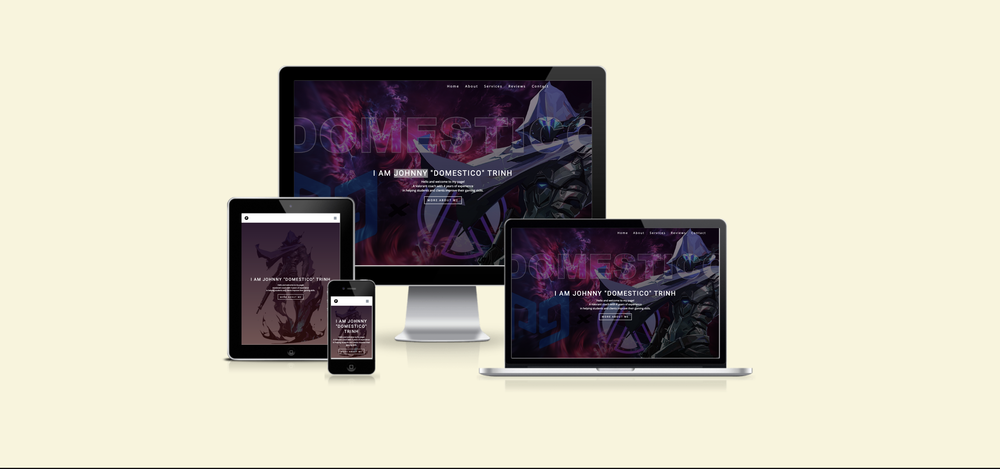
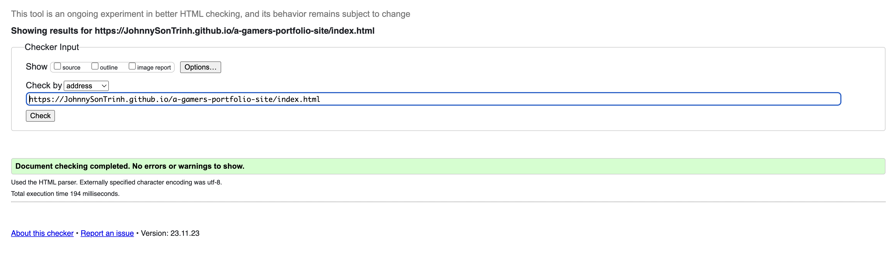
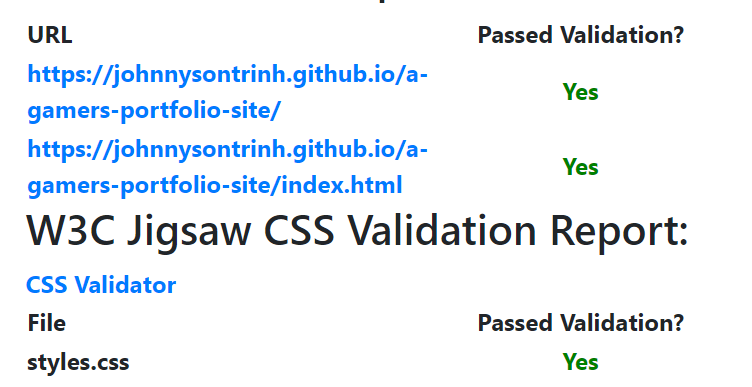
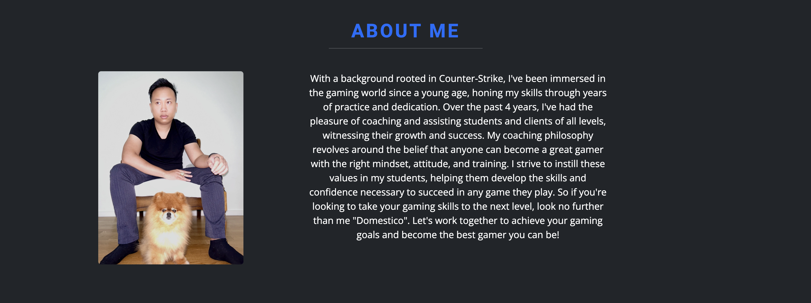
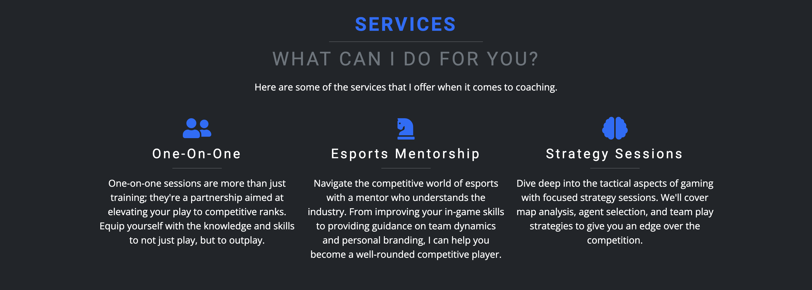
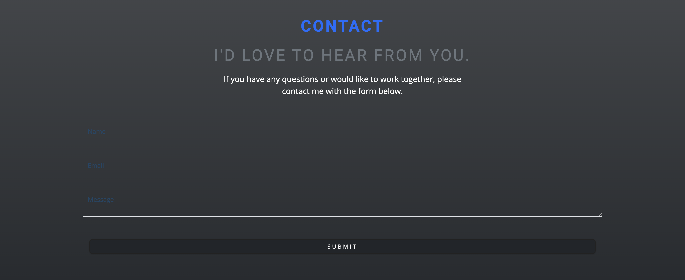

# [COACH DOMESTICO](https://johnnysontrinh.github.io/a-gamers-portfolio-site)


**Table of contents:**

- [Introduction](#introduction)
- [User Experience](#user-experience)
  - [User Goals](#user-goals)
  - [Site Owners-goals](#site-owners-goals)
  - [Requirements](#requirements)
  - [Expectations](#expectations)
- [Wireframes](#wireframes)
- [UX](#ux)
  - [Colors Scheme](#colors-scheme)
  - [TypoGraphy](#typography)
- [Features](#features)
  - [Existing Features](#existing-features)
  - [Future Features](#future-features)
- [Technologies](#technologies)
  - [Language](#language)
  - [Tools](#tools)
  - [Frameworks & Libaries](#frameworks-libaries)
- [Testing](#testing)
  - [HTML](#html)
  - [CSS](#css)
  - [Browser Compatibility](#browser-compatibility)
- [Deployment](#deployment)
  - [Local Deployment](#local-deployment)
  - [Cloning](#cloning)
  - [Forking](#forking)
- [Credits](#credits)
  - [Content](#content)
  - [Media](#media)
  - [Acknowledgements](#acknowledgements)

<a id=#introduction></a>

## Introduction



Welcome to [Coach Domestico's Portfolio Site](https://johnnysontrinh.github.io/a-gamers-portfolio-site), a dedicated platform showcasing professional gaming credentials and personalized coaching services. This website is a nexus where my passion for gaming and expertise in web development converge, creating an engaging space for Valorant players seeking to elevate their skills.

<a id=#user-experience></a>

## User Experience

<a id=#user-goals></a>

### User Goals

- Visually appealing, including images.
- Easily navigated around.
- Quality and valuable content.
- Easily found contact details.

<a id=#site-owners-goals></a>

### Site Owner's Goals

- Showcase professional gaming credentials and coaching services to attract clients seeking personal coaching in Valorant.
- Provide detailed information about coaching methods, success stories, and available sessions.
- Establish credibility through sharing testimonials and experiences from previous clients.
- Improve online visibility and attract traffic from potential clients and gaming enthusiasts.

<a id=#requirements></a>

### Requirements

- Responsive design for a seamless experience on desktop, tablet, and mobile devices.
- Upfront and clear information about the services and value proposition of the gaming portfolio.
- A straightforward method for users to reach out via contact forms or social media.
- A design that captures the dynamic and immersive world of gaming and Valorant!

<a id=#expectations></a>

### Expectations

- All external links, especially to social media channels, open in new tabs to facilitate easy return navigation.
- Every internal link, from navigation menus to call-to-action buttons, functions correctly guiding users without error.
- the quality and performance of the website should be consistent across all devices and screen sizes.
- All content, from biographical details to service offerings, should be current, precise and accurate.

<a id=#wireframes></a>

## Wireframes

For wireframing and viual structuring of my website's layout and design, I chose to utilize [Balsamiq](http://balsamiq.com/wireframes/ "Balsamic"). This tool allowed me to meticulously plan for a user-centric interface, ensuring that the experiance remains consistent and accessible on various devices. My goal throughout the design process was to prioritize ease of use and maintain a cohesive aesthetic from one to the next.

The wireframes are below:

### [Desktop Wireframe](documentation/wireframe-desktop.png "Desktop Wireframe")

### [Tablet Wireframe](documentation/wireframe-tablet.png "Tablet Wireframe")

### [Mobile Wireframe](documentation/wireframe-mobile.png "Mobile Wireframe")

## UX

<a id=#colors-scheme></a>

### Colors Scheme

I used [coolors.co](https://coolors.co/0d6efd-000000-212529-6c757d-ffffff "Coolors") to generate my colour palette.


I've used CSS ':root' variables to easily update the global colour scheme by changing only one value instead of everywhere in the CSS file.

```css
:root {
  /* Primary color shades */
  --clr-primary-1: hsl(205, 86%, 17%);
  --clr-primary-2: hsl(205, 77%, 27%);
  /* Secondary color shades */
  --clr-secondary: rgb(24, 5, 47);
  --clr-grey-1: hsl(209, 61%, 16%);
  --clr-grey-2: hsl(210, 22%, 49%);
  /* White/black color shades */
  --clr-white: #fff;
  --clr-black: #222;
  /* Primary and secondary font families */
  --ff-primary: "Roboto", sans-serif;
  --ff-secondary: "Open Sans", sans-serif;
  /* Commonly used CSS properties for consistency */
  --transition: all 0.3s linear;
  --spacing: 0.25rem;
  --radius: 0.5rem;
  --light-shadow: 0 5px 15px rgba(0, 0, 0, 0.1);
  --max-width: 1170px;
}
```

<a id=#typography></a>

### Typography

- [Roboto](https://fonts.google.com/specimen/Roboto) was used for the primary headers and titles.

- [Open Sans](https://fonts.google.com/specimen/Open+Sans?query=open+sans) was used for all other secondary text.

- [Font Awesome](https://fontawesome.com) icons were used throughout the site, such as the social media icons in the footer.

<a id=#features></a>

## Features

<a id=#existing-features></a>

### Existing Features

- **Navigation Bar**: Fully responsive on all device sizes and interactive.
- **About Me Section**: Detailed information about my professional gaming background and coaching philosophy.
- **Services Section**: An overview of the coaching services I offer.
- **Testimonials Carousel**: Feedback from previous clients to establish credibility.
- **Contact Form**: A simple and intuitive way for potential clients to reach out to me.

<a id=#future-features></a>

### Future Features

- **Live Session Booking**: An integrated booking system for clients to schedule coaching sessions.
- **Blog**: Regular updates and insights on gaming strategies and industry trends.
- **Multimedia Content**: Video tutorials and gameplay analysis.
- **Community Forum**: A space for clients to discuss strategies and share experiences.

## Tools & Technologies Used

- [HTML](https://en.wikipedia.org/wiki/HTML) used for the main site content.
- [CSS](https://en.wikipedia.org/wiki/CSS) used for the main site design and layout.
- [CSS :root variables](https://www.w3schools.com/css/css3_variables.asp) used for reusable styles throughout the site.
- [CSS Flexbox](https://www.w3schools.com/css/css3_flexbox.asp) used for an enhanced responsive layout.
- [CSS Grid](https://www.w3schools.com/css/css_grid.asp) used for an enhanced responsive layout.
- [JavaScript](https://www.javascript.com) used for user interaction on the site.
- [Git](https://git-scm.com) used for version control. (`git add`, `git commit`, `git push`)
- [GitHub](https://github.com) used for secure online code storage.
- [GitHub Pages](https://pages.github.com) used for hosting the deployed front-end site.
- [Gitpod](https://gitpod.io) used as a cloud-based IDE for development.
- [Visual Studio Code](https://code.visualstudio.com/) used as a cloud-based IDE for development.
- [Bootstrap](https://getbootstrap.com) used as the front-end CSS framework for responsive design.
<a id=technologies></a>
<a id=language></a>
<a id=tools></a>
<a id=frameworks-libaries></a>
<a id=#testing></a>

## Testing

<a id=#html></a>

### HTML

I have used the recommended [HTML W3C Validator](https://validator.w3.org) to validate all of my HTML files.

| Page | W3C URL                                                                                                               | Screenshot                                                    | Notes           |
| ---- | --------------------------------------------------------------------------------------------------------------------- | ------------------------------------------------------------- | --------------- |
| Home | [W3C](https://validator.w3.org/nu/?doc=https%3A%2F%2FJohnnySonTrinh.github.io%2Fa-gamers-portfolio-site%2Findex.html) |  | Pass: No Errors |

<a id=#css></a>

### CSS

I have used the recommended [CSS Jigsaw Validator](https://jigsaw.w3.org/css-validator) to validate all of my CSS files.

| File      | Jigsaw URL                                                                                                                   | Screenshot                                                    | Notes           |
| --------- | ---------------------------------------------------------------------------------------------------------------------------- | ------------------------------------------------------------- | --------------- |
| style.css | [Jigsaw](https://jigsaw.w3.org/css-validator/validator?uri=https%3A%2F%2FJohnnySonTrinh.github.io%2Fa-gamers-portfolio-site) |  | Pass: No Errors |

<a id=#browser compatibility></a>

## Browser Compatibility

I've tested my deployed project on multiple browsers to check for compatibility issues.

| Browser                              | Home                                                         | About                                                         | Services                                                         | Reviews                                                         | Contact                                                         | Notes             |
| ------------------------------------ | ------------------------------------------------------------ | ------------------------------------------------------------- | ---------------------------------------------------------------- | --------------------------------------------------------------- | --------------------------------------------------------------- | ----------------- |
| Chrome                               |  |  |  |  |  | Works as expected |
| repeat for any other tested browsers | x                                                            | x                                                             | x                                                                | x                                                               | x                                                               |

<a id=#deployment></a>

## Deployment

The site was deployed to GitHub Pages. The steps to deploy are as follows:

- In the [GitHub repository](https://github.com/JohnnySonTrinh/a-gamers-portfolio-site), navigate to the Settings tab
- From the source section drop-down menu, select the **Main** Branch, then click "Save".
- The page will be automatically refreshed with a detailed ribbon display to indicate the successful deployment.

The live link can be found [here](https://johnnysontrinh.github.io/a-gamers-portfolio-site)

<a id=#local-deployment></a>

### Local Deployment

This project can be cloned or forked in order to make a local copy on your own system.

<a id=#cloning></a>

### Cloning

You can clone the repository by following these steps:

1. Go to the [GitHub repository](https://github.com/JohnnySonTrinh/a-gamers-portfolio-site)
2. Locate the Code button above the list of files and click it
3. Select if you prefer to clone using HTTPS, SSH, or GitHub CLI and click the copy button to copy the URL to your clipboard
4. Open Git Bash or Terminal
5. Change the current working directory to the one where you want the cloned directory
6. In your IDE Terminal, type the following command to clone my repository:
   - `git clone https://github.com/JohnnySonTrinh/a-gamers-portfolio-site.git`
7. Press Enter to create your local clone.

Alternatively, if using Gitpod, you can click below to create your own workspace using this repository.

[](https://gitpod.io/#https://github.com/JohnnySonTrinh/a-gamers-portfolio-site)

Please note that in order to directly open the project in Gitpod, you need to have the browser extension installed.
A tutorial on how to do that can be found [here](https://www.gitpod.io/docs/configure/user-settings/browser-extension).

<a id=#forking></a>

### Forking

By forking the GitHub Repository, we make a copy of the original repository on our GitHub account to view and/or make changes without affecting the original owner's repository.
You can fork this repository by using the following steps:

1. Log in to GitHub and locate the [GitHub Repository](https://github.com/JohnnySonTrinh/a-gamers-portfolio-site)
2. At the top of the Repository (not top of page) just above the "Settings" Button on the menu, locate the "Fork" Button.
3. Once clicked, you should now have a copy of the original repository in your own GitHub account!

<a id=#credits></a>

## Credits

This project would not have been possible without the following resources and contributions:

<a id=#content></a>

### Content

The content for the "About Me" and "Services" sections were written by me, based on my professional gaming experiences.

<a id=#media></a>

### Media

- All in-game screenshots and images were taken by myself.
- The photos used in this site were obtained from [Pexels](https://www.pexels.com).
- Game icons and logos were provided by [Font Awesome](https://fontawesome.com).

<a id=#acknowledgements></a>

### Acknowledgements

- I would like to thank my mentor, [Tim Nelson](https://github.com/TravelTimN) for their support throughout the development of this project.
- Thanks to my fellow gamers and peers at [Proguides](https://proguides.com)
