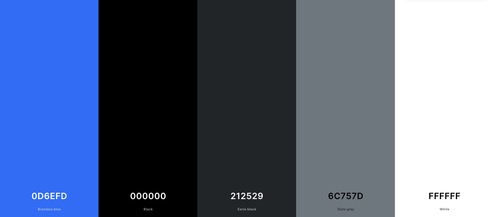

# [A GAMERS PORTFOLIO SITE](https://johnnysontrinh.github.io/a-gamers-portfolio-site)


## UX

### Colour Scheme

- `#000000` used for primary text.
- `#E84610` used for primary highlights.
- `#4A4A4F` used for secondary text.
- `#009FE3` used for secondary highlights.

I used [coolors.co](https://coolors.co/e84610-009fe3-4a4a4f-445261-d63649-e6ecf0-000000) to generate my colour palette.



I've used CSS `:root` variables to easily update the global colour scheme by changing only one value, instead of everywhere in the CSS file.

```css
:root {
  /* P = Primary | S = Secondary */
  --p-text: #000000;
  --p-highlight: #e84610;
  --s-text: #4a4a4f;
  --s-highlight: #009fe3;
  --white: #ffffff;
  --black: #000000;
}
```

### Typography

- [Montserrat](https://fonts.google.com/specimen/Montserrat) was used for the primary headers and titles.

- [Lato](https://fonts.google.com/specimen/Lato) was used for all other secondary text.

- [Font Awesome](https://fontawesome.com) icons were used throughout the site, such as the social media icons in the footer.

## User Stories

### New Site Users

- As a new site user, I would like to \***\*\_\_\_\_\*\***, so that I can \***\*\_\_\_\_\*\***.
- As a new site user, I would like to \***\*\_\_\_\_\*\***, so that I can \***\*\_\_\_\_\*\***.
- As a new site user, I would like to \***\*\_\_\_\_\*\***, so that I can \***\*\_\_\_\_\*\***.
- As a new site user, I would like to \***\*\_\_\_\_\*\***, so that I can \***\*\_\_\_\_\*\***.
- As a new site user, I would like to \***\*\_\_\_\_\*\***, so that I can \***\*\_\_\_\_\*\***.

### Returning Site Users

- As a returning site user, I would like to \***\*\_\_\_\_\*\***, so that I can \***\*\_\_\_\_\*\***.
- As a returning site user, I would like to \***\*\_\_\_\_\*\***, so that I can \***\*\_\_\_\_\*\***.
- As a returning site user, I would like to \***\*\_\_\_\_\*\***, so that I can \***\*\_\_\_\_\*\***.
- As a returning site user, I would like to \***\*\_\_\_\_\*\***, so that I can \***\*\_\_\_\_\*\***.
- As a returning site user, I would like to \***\*\_\_\_\_\*\***, so that I can \***\*\_\_\_\_\*\***.

## Wireframes

To follow best practice, wireframes were developed for mobile, tablet, and desktop sizes.
I've used [Balsamiq](https://balsamiq.com/wireframes) to design my site wireframes.

### Mobile Wireframes

< details >
< summary > Click here to see the Mobile Wireframes < / summary >

Home

- 

About

- 

Contact

- 

Gallery

- 

etc.

- repeat for any remaining mobile wireframes

< / details >

### Tablet Wireframes

< details >
< summary > Click here to see the Tablet Wireframes < / summary >

Home

- 

About

- 

Contact

- 

Gallery

- 

etc.

- repeat for any remaining tablet wireframes

< / details >

### Desktop Wireframes

< details >
< summary > Click here to see the Desktop Wireframes < / summary >

Home

- 

About

- 

Contact

- 

Gallery

- 

etc.

- repeat for any remaining desktop wireframes

< / details >

## Features

### Existing Features

- **Title for feature #1**

  - Details about this particular feature, including the value to the site, and benefit for the user. Be as detailed as possible!


- **Title for feature #2**

  - Details about this particular feature, including the value to the site, and benefit for the user. Be as detailed as possible!


- **Title for feature #3**

  - Details about this particular feature, including the value to the site, and benefit for the user. Be as detailed as possible!


### Future Features

- Title for future feature #1
  - Any additional notes about this feature.
- Title for future feature #2
  - Any additional notes about this feature.
- Title for future feature #3
  - Any additional notes about this feature.

## Tools & Technologies Used

- [HTML](https://en.wikipedia.org/wiki/HTML) used for the main site content.
- [CSS](https://en.wikipedia.org/wiki/CSS) used for the main site design and layout.
- [CSS :root variables](https://www.w3schools.com/css/css3_variables.asp) used for reusable styles throughout the site.
- [CSS Flexbox](https://www.w3schools.com/css/css3_flexbox.asp) used for an enhanced responsive layout.
- [CSS Grid](https://www.w3schools.com/css/css_grid.asp) used for an enhanced responsive layout.
- [JavaScript](https://www.javascript.com) used for user interaction on the site.
- [Python](https://www.python.org) used as the back-end programming language.
- [Git](https://git-scm.com) used for version control. (`git add`, `git commit`, `git push`)
- [GitHub](https://github.com) used for secure online code storage.
- [GitHub Pages](https://pages.github.com) used for hosting the deployed front-end site.
- [Gitpod](https://gitpod.io) used as a cloud-based IDE for development.
- [Codeanywhere](https://codeanywhere.com) used as a cloud-based IDE for development.
- [Bootstrap](https://getbootstrap.com) used as the front-end CSS framework for modern responsiveness and pre-built components.
- [Materialize](https://materializecss.com) used as the front-end CSS framework for modern responsiveness and pre-built components.
- [Flask](https://flask.palletsprojects.com) used as the Python framework for the site.
- [Django](https://www.djangoproject.com) used as the Python framework for the site.
- [MongoDB](https://www.mongodb.com) used as the non-relational database management with Flask.
- [SQLAlchemy](https://www.sqlalchemy.org) used as the relational database management with Flask.
- [PostgreSQL](https://www.postgresql.org) used as the relational database management.
- [ElephantSQL](https://www.elephantsql.com) used as the Postgres database.
- [Heroku](https://www.heroku.com) used for hosting the deployed back-end site.
- [Cloudinary](https://cloudinary.com) used for online static file storage.
- [Stripe](https://stripe.com) used for online secure payments of ecommerce products/services.
- [AWS S3](https://aws.amazon.com/s3) used for online static file storage.

## Testing

For all testing, please refer to the [TESTING.md](TESTING.md) file.

## Deployment

The site was deployed to GitHub Pages. The steps to deploy are as follows:

- In the [GitHub repository](https://github.com/JohnnySonTrinh/a-gamers-portfolio-site), navigate to the Settings tab
- From the source section drop-down menu, select the **Main** Branch, then click "Save".
- The page will be automatically refreshed with a detailed ribbon display to indicate the successful deployment.

The live link can be found [here](https://johnnysontrinh.github.io/a-gamers-portfolio-site)

### Local Deployment

This project can be cloned or forked in order to make a local copy on your own system.

#### Cloning

You can clone the repository by following these steps:

1. Go to the [GitHub repository](https://github.com/JohnnySonTrinh/a-gamers-portfolio-site)
2. Locate the Code button above the list of files and click it
3. Select if you prefer to clone using HTTPS, SSH, or GitHub CLI and click the copy button to copy the URL to your clipboard
4. Open Git Bash or Terminal
5. Change the current working directory to the one where you want the cloned directory
6. In your IDE Terminal, type the following command to clone my repository:
   - `git clone https://github.com/JohnnySonTrinh/a-gamers-portfolio-site.git`
7. Press Enter to create your local clone.

Alternatively, if using Gitpod, you can click below to create your own workspace using this repository.

[](https://gitpod.io/#https://github.com/JohnnySonTrinh/a-gamers-portfolio-site)

Please note that in order to directly open the project in Gitpod, you need to have the browser extension installed.
A tutorial on how to do that can be found [here](https://www.gitpod.io/docs/configure/user-settings/browser-extension).

#### Forking

By forking the GitHub Repository, we make a copy of the original repository on our GitHub account to view and/or make changes without affecting the original owner's repository.
You can fork this repository by using the following steps:

1. Log in to GitHub and locate the [GitHub Repository](https://github.com/JohnnySonTrinh/a-gamers-portfolio-site)
2. At the top of the Repository (not top of page) just above the "Settings" Button on the menu, locate the "Fork" Button.
3. Once clicked, you should now have a copy of the original repository in your own GitHub account!

### Local VS Deployment

## Credits

### Content

| Source                                                                      | Location           | Notes                                            |
| --------------------------------------------------------------------------- | ------------------ | ------------------------------------------------ |
| [Markdown Builder](https://tim.2bn.dev/markdown-builder)                    | README and TESTING | tool to help generate the Markdown files         |
| [Chris Beams](https://chris.beams.io/posts/git-commit)                      | version control    | "How to Write a Git Commit Message"              |
| [W3Schools](https://www.w3schools.com/howto/howto_js_topnav_responsive.asp) | entire site        | responsive HTML/CSS/JS navbar                    |
| [W3Schools](https://www.w3schools.com/howto/howto_css_modals.asp)           | contact page       | interactive pop-up (modal)                       |
| [W3Schools](https://www.w3schools.com/css/css3_variables.asp)               | entire site        | how to use CSS :root variables                   |
| [Flexbox Froggy](https://flexboxfroggy.com/)                                | entire site        | modern responsive layouts                        |
| [Grid Garden](https://cssgridgarden.com)                                    | entire site        | modern responsive layouts                        |
| [StackOverflow](https://stackoverflow.com/a/2450976)                        | quiz page          | Fisher-Yates/Knuth shuffle in JS                 |
| [YouTube](https://www.youtube.com/watch?v=YL1F4dCUlLc)                      | leaderboard        | using `localStorage()` in JS for high scores     |
| [YouTube](https://www.youtube.com/watch?v=u51Zjlnui4Y)                      | PP3 terminal       | tutorial for adding color to the Python terminal |
| [strftime](https://strftime.org)                                            | CRUD functionality | helpful tool to format date/time from string     |
| [WhiteNoise](http://whitenoise.evans.io)                                    | entire site        | hosting static files on Heroku temporarily       |

### Media

| Source                                                           | Location     | Type  | Notes                                        |
| ---------------------------------------------------------------- | ------------ | ----- | -------------------------------------------- |
| [Pexels](https://www.pexels.com)                                 | entire site  | image | favicon on all pages                         |
| [Lorem Picsum](https://picsum.photos)                            | home page    | image | hero image background                        |
| [Unsplash](https://unsplash.com)                                 | product page | image | sample of fake products                      |
| [Pixabay](https://pixabay.com)                                   | gallery page | image | group of photos for gallery                  |
| [Wallhere](https://wallhere.com)                                 | footer       | image | background wallpaper image in the footer     |
| [This Person Does Not Exist](https://thispersondoesnotexist.com) | testimonials | image | headshots of fake testimonial images         |
| [Audio Micro](https://www.audiomicro.com/free-sound-effects)     | game page    | audio | free audio files to generate the game sounds |
| [Videvo](https://www.videvo.net/)                                | home page    | video | background video on the hero section         |
| [TinyPNG](https://tinypng.com)                                   | entire site  | image | tool for image compression                   |

### Acknowledgements

- I would like to thank my Code Institute mentor, [Tim Nelson](https://github.com/TravelTimN) for their support throughout the development of this project.
- I would like to thank the [Code Institute](https://codeinstitute.net) tutor team for their assistance with troubleshooting and debugging some project issues.
- I would like to thank the [Code Institute Slack community](https://code-institute-room.slack.com) for the moral support; it kept me going during periods of self doubt and imposter syndrome.
- I would like to thank my partner (John/Jane), for believing in me, and allowing me to make this transition into software development.
- I would like to thank my employer, for supporting me in my career development change towards becoming a software developer.
