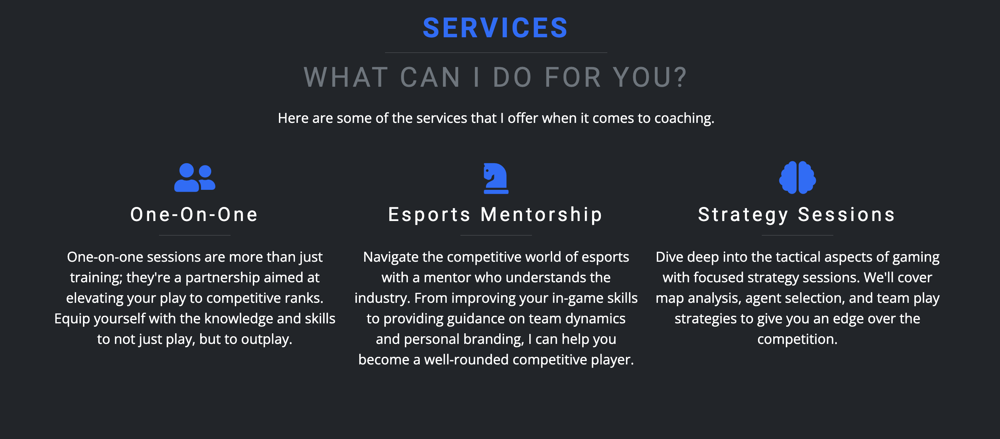
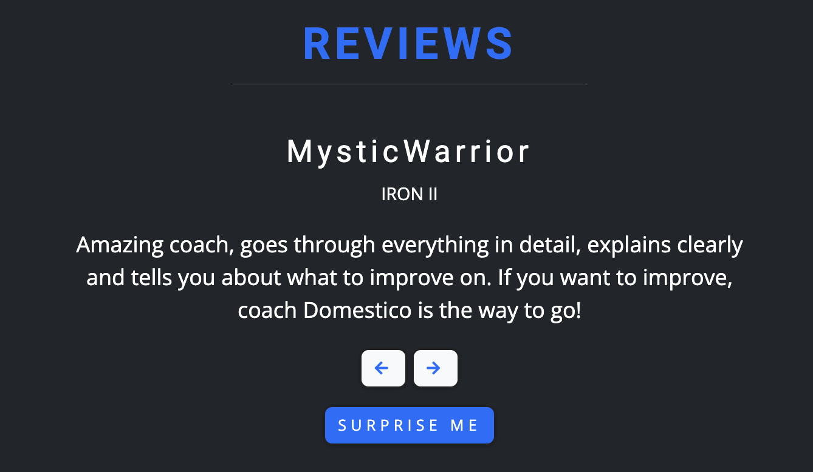
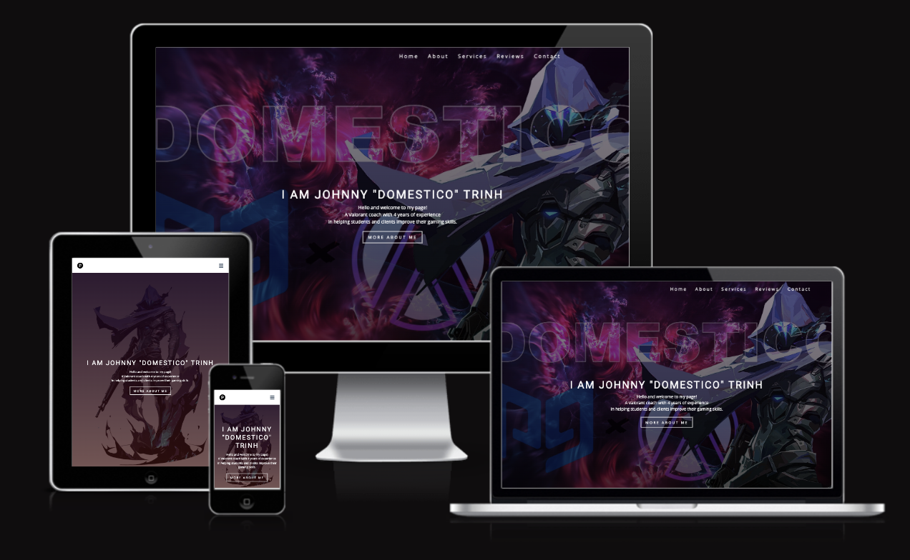

# [A GAMERS PORTFOLIO SITE](https://johnnysontrinh.github.io/a-gamers-portfolio-site)


Immerse yourself in a unique digital journey with "A Gamer's Portfolio Site," where the pulse of gaming meets the finesse of web development. This site isn't just a showcase; it's a nexus of my passion for video games and my proficiency in front-end development. It's crafted to not only display my technical skills but also to resonate with the vibrant spirit of the gaming community.

This website is a nexus where my passion for gaming and expertise in web development converge, creating an engaging space for Valorant players seeking to elevate their skills.

## UX

### Colors Scheme

I used [coolors.co](https://coolors.co/0d6efd-000000-212529-6c757d-ffffff) to generate my colour palette.


I've used CSS ':root' variables to easily update the global colour scheme by changing only one value instead of everywhere in the CSS file.

```css
:root {
  /* Primary color shades */
  --clr-primary-1: hsl(205, 86%, 17%);
  --clr-primary-2: hsl(205, 77%, 27%);
  /* Secondary color shades */
  --clr-secondary: rgb(24, 5, 47);
  --clr-grey-1: hsl(209, 61%, 16%);
  --clr-grey-2: hsl(210, 22%, 49%);
  /* White/black color shades */
  --clr-white: #fff;
  --clr-black: #222;
  /* Primary and secondary font families */
  --ff-primary: "Roboto", sans-serif;
  --ff-secondary: "Open Sans", sans-serif;
  /* Commonly used CSS properties for consistency */
  --transition: all 0.3s linear;
  --spacing: 0.25rem;
  --radius: 0.5rem;
  --light-shadow: 0 5px 15px rgba(0, 0, 0, 0.1);
  --max-width: 1170px;
}
```

### Typography

- [Roboto](https://fonts.google.com/specimen/Roboto) was used for the primary headers and titles.

- [Open Sans](https://fonts.google.com/specimen/Open+Sans?query=open+sans) was used for all other secondary text.

- [Font Awesome](https://fontawesome.com) icons were used throughout the site, such as the social media icons in the footer.

## User Experience

### User Goals

- Visually appealing, including images.
- Easily navigated around.
- Quality and valuable content.
- Easily found contact details.

### Site Owner's Goals

- Showcase professional gaming credentials and coaching services to attract clients seeking personal coaching in Valorant.
- Provide detailed information about coaching methods, success stories, and available sessions.
- Establish credibility through sharing testimonials and experiences from previous clients.
- Improve online visibility and attract traffic from potential clients and gaming enthusiasts.

### Requirements

- Responsive design for a seamless experience on desktop, tablet, and mobile devices.
- Upfront and clear information about the services and value proposition of the gaming portfolio.
- A straightforward method for users to reach out via contact forms or social media.
- A design that captures the dynamic and immersive world of gaming and Valorant!

### Expectations

- All external links, especially to social media channels, open in new tabs to facilitate easy return navigation.
- Every internal link, from navigation menus to call-to-action buttons, functions correctly guiding users without error.
- the quality and performance of the website should be consistent across all devices and screen sizes.
- All content, from biographical details to service offerings, should be current, precise and accurate.

## Wireframes

For wireframing and viual structuring of my website's layout and design, I chose to utilize [Balsamiq](http://balsamiq.com/wireframes/ "Balsamic"). This tool allowed me to meticulously plan for a user-centric interface, ensuring that the experiance remains consistent and accessible on various devices. My goal throughout the design process was to prioritize ease of use and maintain a cohesive aesthetic from one to the next.

 <details>

 <summary>Desktop Wireframe</summary>


 </details>

 <details>

 <summary>Tablet Wireframe</summary>


 </details>

 <details>
    <summary>Mobile Wireframe</summary>


 </details>

## Features

### Existing Features

#### Interactive Navigation Bar

- Description: A responsive navigation bar that allows easy access to all sections of the site. It's designed to be intuitive and enhances the overall user experience.
- Screenshot:
  

#### Professional Profile

- Description: This section showcases your gaming credentials, achievements, and coaching philosophy. It serves as an introduction to new clients and builds credibility.
- Screenshot:
  

#### Coaching Services Overview

- Description: Detailed information about the coaching services offered, including session structure, strategies, and personalization aspects. This section helps clients understand what they can expect from your coaching.
- Screenshot:
  

#### Reviews Carousel

- Description: A carousel feature displaying testimonials from previous clients. This section highlights the positive impact and success stories of your coaching.
- Screenshot:
  

#### Contact Form

- Description: An easy-to-use contact form for potential clients to make inquiries. It's designed to be straightforward and user-friendly.
- Screenshot:
  

#### Responsive Design

- Description: The website is optimized for a seamless experience on various devices and screen sizes, ensuring accessibility and convenience.
- [Screenshot](https://ui.dev/amiresponsive?url=https://johnnysontrinh.github.io/a-gamers-portfolio-site/):
  

### Future Features

- **Live Session Booking**: An integrated booking system for clients to schedule coaching sessions.
- **Blog**: Regular updates and insights on gaming strategies and industry trends.
- **Multimedia Content**: Video tutorials and gameplay analysis.
- **Community Forum**: A space for clients to discuss strategies and share experiences.

## Tools & Technologies Used

- [HTML](https://en.wikipedia.org/wiki/HTML) used for the main site content.
- [CSS](https://en.wikipedia.org/wiki/CSS) used for the main site design and layout.
- [CSS :root variables](https://www.w3schools.com/css/css3_variables.asp) used for reusable styles throughout the site.
- [CSS Flexbox](https://www.w3schools.com/css/css3_flexbox.asp) used for an enhanced responsive layout.
- [CSS Grid](https://www.w3schools.com/css/css_grid.asp) used for an enhanced responsive layout.
- [JavaScript](https://www.javascript.com) used for user interaction on the site.
- [Git](https://git-scm.com) used for version control. (`git add`, `git commit`, `git push`)
- [GitHub](https://github.com) used for secure online code storage.
- [GitHub Pages](https://pages.github.com) used for hosting the deployed front-end site.
- [Visual Studio Code](https://code.visualstudio.com/) used as a cloud-based IDE for development.
- [Bootstrap](https://getbootstrap.com) used as the front-end CSS framework for responsive design.
- [Am I Responsive](http://ami.responsivedesign.is/) - Used to verify responsiveness of website on different devices.
- [DaVinci Resolve](https://www.blackmagicdesign.com/products/davinciresolve) used for editing my hero image.

## Testing

For all testing, please refer to the [TESTING.md](TESTING.md) file.

## Deployment

The site was deployed to GitHub Pages. The steps to deploy are as follows:

- In the [GitHub repository](https://github.com/JohnnySonTrinh/a-gamers-portfolio-site), navigate to the Settings tab
- From the source section drop-down menu, select the **Main** Branch, then click "Save".
- The page will be automatically refreshed with a detailed ribbon display to indicate the successful deployment.

The live link can be found [here](https://johnnysontrinh.github.io/a-gamers-portfolio-site)

### Local Deployment

This project can be cloned or forked in order to make a local copy on your own system.

### Cloning

You can clone the repository by following these steps:

1. Go to the [GitHub repository](https://github.com/JohnnySonTrinh/a-gamers-portfolio-site)
2. Locate the Code button above the list of files and click it
3. Select if you prefer to clone using HTTPS, SSH, or GitHub CLI and click the copy button to copy the URL to your clipboard
4. Open Git Bash or Terminal
5. Change the current working directory to the one where you want the cloned directory
6. In your IDE Terminal, type the following command to clone my repository:
   - `git clone https://github.com/JohnnySonTrinh/a-gamers-portfolio-site.git`
7. Press Enter to create your local clone.

Alternatively, if using Gitpod, you can click below to create your own workspace using this repository.

[](https://gitpod.io/#https://github.com/JohnnySonTrinh/a-gamers-portfolio-site)

Please note that in order to directly open the project in Gitpod, you need to have the browser extension installed.
A tutorial on how to do that can be found [here](https://www.gitpod.io/docs/configure/user-settings/browser-extension).

### Forking

By forking the GitHub Repository, we make a copy of the original repository on our GitHub account to view and/or make changes without affecting the original owner's repository.
You can fork this repository by using the following steps:

1. Log in to GitHub and locate the [GitHub Repository](https://github.com/JohnnySonTrinh/a-gamers-portfolio-site)
2. At the top of the Repository (not top of page) just above the "Settings" Button on the menu, locate the "Fork" Button.
3. Once clicked, you should now have a copy of the original repository in your own GitHub account!

### Local vs. Deployment

#### Path Issue and Resolution

During the development and deployment of the website, I encountered a bug related to the path used for loading images. In the local development environment, the images were loaded using a relative path that included the parent directory (e.g., `../assets/images/hero.webp`). However, this path structure caused issues in the deployed environment on GitHub Pages, where the images were not loading correctly.

To resolve this issue, I modified the image paths to be relative from the root of the project. This change ensures that the image paths are correctly interpreted both locally and in the deployed environment. For example, the path was changed from `../assets/images/hero.webp` to `assets/images/hero.webp`.

#### Impact on Deployment

This adjustment was crucial for the seamless deployment of the website. Now, all images and resources load correctly regardless of the environment, ensuring a consistent and visually appealing experience for all users.

It's important to note that this change is specific to the structure and deployment method of this project. Other projects or deployment methods might require different approaches to handle resource paths effectively.

## Credits

I am immensely grateful for the various resources and individuals who contributed to the successful completion of this project:

### Content

The content featured on this site, especially within the "About Me" and "Services" sections, has been sourced and adapted from my professional profile on [ProGuides](https://www.proguides.com/coach/domestico). This includes:

- **About Me**: The narrative in this section is derived from my personal coaching bio on ProGuides. It provides an authentic insight into my background, coaching philosophy, and approach to gaming, directly reflecting my professional journey and expertise.

- **Services Offered**: The descriptions of coaching services, methodologies, and session details are based on the offerings listed on my ProGuides profile. This ensures that the information presented is accurate and aligns with the services I provide in a professional capacity.

- **Client Testimonials**: The reviews section of the site showcases genuine feedback and testimonials from students and clients who have previously availed of my coaching services through ProGuides. These testimonials are a testament to the positive experiences and successful outcomes of my coaching sessions.

The content adaptation from my ProGuides profile to this website was done with the intention of maintaining consistency in my online presence, ensuring that visitors get a cohesive and comprehensive understanding of my coaching style and gaming expertise.

### Media

The visual elements play a crucial role in creating an immersive and engaging experience on the site. Here's a breakdown of the various media sources:

- **Logo and Tab Bar Icons**:  The site's logo and favicon, crucial for branding and identity, were created using [Favicon.io's Favicon Generator](https://favicon.io/favicon-generator). This tool allowed for the crafting of distinct and recognizable icons that resonate with the site's gaming theme.

- **In-Game Screenshots**: All in-game screenshots and images, showcasing actual gaming moments and achievements, were personally captured by me. These images add authenticity and provide visitors with a glimpse into the real gaming experiences and successes I've had.

- **Hero Section Image**: The striking image of Agent Omen, featured prominently in the hero section, was sourced from [Valorant Wiki](https://valorant.fandom.com/wiki/Omen). This particular image helps set the tone for the website, aligning with the Valorant theme.

- **Game Icons and Logos**: Various icons from [Font Awesome](https://fontawesome.com) are utilized throughout the site to enhance its aesthetic appeal and user navigation. Specific icons include:
  - [Arrow-up Icon](https://fontawesome.com/icons/arrow-up?f=classic&s=solid&an=beat) for a smooth scroll-to-top feature.
  - Social media icons like [GitHub](https://fontawesome.com/icons/github?f=brands&s=solid), [Instagram](https://fontawesome.com/icons/instagram?f=brands&s=solid), and [LinkedIn](https://fontawesome.com/icons/linkedin?f=brands&s=solid) to facilitate easy connectivity with users on various platforms.

Each media element has been thoughtfully chosen to complement the website's theme and enhance the user's visual experience.

### Acknowledgements

- A special thanks to my mentor, [Tim Nelson](https://github.com/TravelTimN), for their invaluable guidance, support, and insights throughout the development process
- Gratitude is also extended to my fellow gamers and peers at [Proguides](https://proguides.com) for their feedback, encouragement, and for being an ongoing source of inspiration and camaraderie in the gaming community.
- A special mention to my dog, Loke, who has been an unexpected companion in this coding adventure. His presence and, in his own way, helping me 'debug' my code during those long nights has been a source of comfort and motivation.

This project is a testament not just to the collaborative effort and shared passion for gaming, but also to the support and inspiration found in the most unexpected places. I am sincerely thankful for every contribution that has helped bring this project to life.
