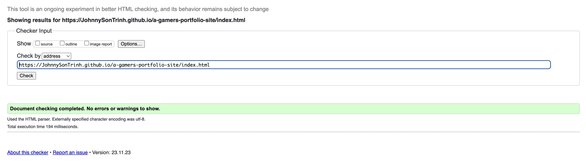
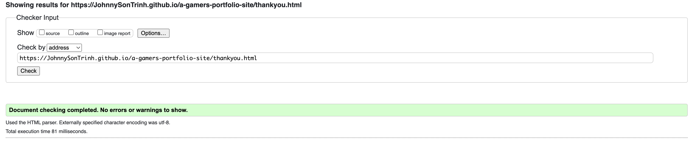

# Testing

Return back to the [README.md](README.md) file.

Welcome to the A Gamers Portofolio Site testing results, in this file you will see how each and every element tested to ensure each element worked as intended.

## Code Validation

### HTML

I have used the recommended [HTML W3C Validator](https://validator.w3.org) to validate all of my HTML files.

| Page     | W3C URL                                                                                                                  | Screenshot                                                        | Notes           |
| -------- | ------------------------------------------------------------------------------------------------------------------------ | ----------------------------------------------------------------- | --------------- |
| Home     | [W3C](https://validator.w3.org/nu/?doc=https%3A%2F%2FJohnnySonTrinh.github.io%2Fa-gamers-portfolio-site%2Findex.html)    |      | Pass: No Errors |
| Thankyou | [W3C](https://validator.w3.org/nu/?doc=https%3A%2F%2FJohnnySonTrinh.github.io%2Fa-gamers-portfolio-site%2Fthankyou.html) |  | Pass: No Errors |

### CSS

I have used the recommended [CSS Jigsaw Validator](https://jigsaw.w3.org/css-validator) to validate all of my CSS files.

| File      | Jigsaw URL                                                                                                                   | Screenshot                                              | Notes                                       |
| --------- | ---------------------------------------------------------------------------------------------------------------------------- | ------------------------------------------------------- | ------------------------------------------- |
| style.css | [Jigsaw](https://jigsaw.w3.org/css-validator/validator?uri=https%3A%2F%2FJohnnySonTrinh.github.io%2Fa-gamers-portfolio-site) |  | Parse errors: These errors are acknowledged |

### JavaScript

I have used the recommended [JSHint](https://jshint.com/), a JavaScript Code Quality Tool to validate my Javascript file.

| Page | Screenshot                                                                   | Notes           |
| ---- | ---------------------------------------------------------------------------- | --------------- |
| Home |  | Pass: No Errors |

## Browser Compatibility

I've tested my deployed project on multiple browsers to check for compatibility issues.

| Browser  | Screenshot                                                | Notes                 |
| -------- | --------------------------------------------------------- | --------------------- |
| Chrome   |       | Works as expected     |
| Firefox  |     | Works as expected     |
| Safari   |   | Minor CSS differences |
| Opera GX |  | Minor CSS differences |

## Responsiveness

I've tested my deployed project on multiple devices to check for responsiveness issues.

| Device                | Screenshot                                                         | Notes                     |
| --------------------- | ------------------------------------------------------------------ | ------------------------- |
| 4K Monitor (DevTools) |  | Noticeable scaling issues |
| Desktop (DevTools)    |     | Works as expected         |
| Laptop (DevTools)     |      | Works as expected         |
| Tablet (DevTools)     |      | Works as expected         |
| Mobile (DevTools)     |      | Works as expected         |
| Iphone 14             |   | CSS issue with hero image |
| Macbook Air 13        |                     | Works as expected         |
| iPad 2011             |  | Noticeable scaling issue  |

## Lighthouse Audit

I've tested my deployed project using the Lighthouse Audit tool to check for any major issues.

| Desktop                                                        | Notes               |
| -------------------------------------------------------------- | ------------------- |
|  | Some minor warnings |

| Mobile                                                        | Notes                                    |
| ------------------------------------------------------------- | ---------------------------------------- |
|  | Decent response time due to large images |

## User Story Testing

To ensure that the website meets the expectations and needs of its users, I conducted tests based on predefined user stories. These tests verify that the users can achieve their goals through the current features of the website.

| User Story                                                                                                                                            | Screenshot                                                              | Test Result                                                                                                                 |
| ----------------------------------------------------------------------------------------------------------------------------------------------------- | ----------------------------------------------------------------------- | --------------------------------------------------------------------------------------------------------------------------- |
| As a new visitor, I want to easily navigate the site so that I can find information about coaching services without hassle.                           |            | Passed: The site features an intuitive navigation bar that allows for easy browsing of different sections.                  |
| As a potential coaching client, I want to read about the coach's credentials so that I can decide if they're the right fit for my needs.              |  | Passed: The "About Me" section provides a detailed overview of the coach's experience and qualifications.                   |
| As a player looking to improve, I want to understand what kind of coaching sessions are available so that I can choose one that fits my requirements. |        | Passed: The "Services" page outlines various coaching sessions with clear descriptions.                                     |
| As an interested client, I want to see reviews from past students so that I can gauge the effectiveness of the coaching.                              |             | Passed: The "Reviews" section showcases testimonials from previous clients, affirming the success of the coaching sessions. |
| As a site user, I want to easily contact the coach so that I can inquire about personalized coaching sessions.                                        |                 | Passed: The "Contact" page features a simple form that users can fill out to reach out to the coach directly.               |

These tests were performed across various pages and features to ensure that user goals can be achieved efficiently and effectively.

## Bugs

Throughout the development process, I encountered several bugs, which were documented and resolved to enhance the functionality and user experience of the website. Here are some of the notable bugs and their fixes:

| Bug Description                                                                                    | Screenshot                                                                 | Resolution                                                                                                                                                                                                                                                                                                              |
| -------------------------------------------------------------------------------------------------- | -------------------------------------------------------------------------- | ----------------------------------------------------------------------------------------------------------------------------------------------------------------------------------------------------------------------------------------------------------------------------------------------------------------------- |
| Navigation bar not responsive on smaller screens.                                                  |  | Implemented Bootstrap's collapsible navbar to ensure navigation is accessible on mobile devices.                                                                                                                                                                                                                        |
| The arrow-up button intended to help users navigate back to the top of the page was not appearing. |       | Investigated the JavaScript responsible for showing the arrow-up button. Found that the button's visibility was tied to a scroll event listener that wasn't firing as expected. The issue was resolved by adjusting the scroll event threshold and ensuring the function was properly called within the event listener. |
| Contact form submission not redirecting to thank you page.                                         |           | Adjusted the form action URL.                                                                                                                                                                                                                                                                                           |
| Arrow-up button blocking some footer icons.                                                        |       | Added a bottom margin (`mb-5`) and increased the size of the arrow-up icon for improved user interaction.                                                                                                                                                                                                               |
| Text color contrast on the form was too low with blue text, making it hard to read.                |          | Changed the text color to white to improve contrast and readability on the form elements.                                                                                                                                                                                                                               |

These bugs were systematically addressed and tested to ensure they were resolved.

## Unfixed Bugs

During the CSS validation process, several parsing errors were reported. These errors are associated with the minified version of Bootstrap's CSS (version 5.3.2), which is an external library used in the project. Here's an overview of the identified issues:

- **Bootstrap Parsing Errors**: The CSS validator reported parsing errors in the Bootstrap library. As these errors are within an external, well-maintained library, they are beyond the scope of this project's direct codebase. Such parsing errors are known to occur in minified files where optimizations for size may result in unconventional syntax that doesn't affect functionality but may not pass strict validation.

It's important to note that these parsing errors do not impact the performance or visual rendering of the website. The Bootstrap library is widely used and tested, and the errors reported are recognized as false positives that do not indicate actual issues in the library's operation or the website's functionality.

**Screenshot:** 

While these errors are acknowledged, no action is required as they are part of the minified Bootstrap library and not a result of the project's custom CSS code.
